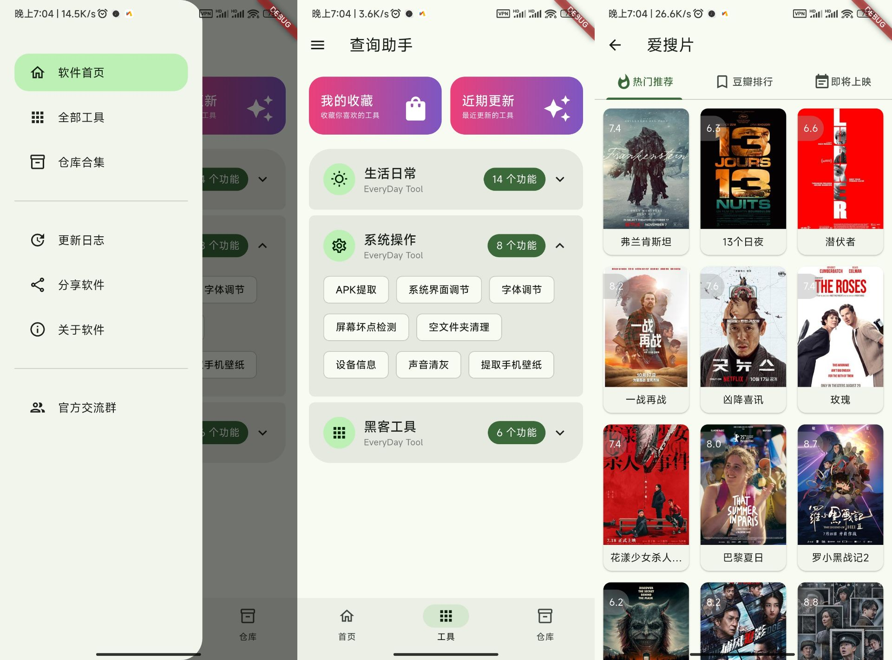

# 查询助手 (Query Assistant)

一个功能丰富的 Flutter 开发的工具箱应用，支持 Android 平台。

## 🧩 项目图片

## 📝 项目简介

查询助手是一个功能强大的工具，旨在帮助普通用户更轻松地完成各种任务。

## 📱 应用特性

- **响应式设计**: 适配不同屏幕尺寸和设备
- **网络请求**: 集成 Dio 进行 HTTP 请求处理
- **现代化 UI**: 使用 Material Design 设计语言
- **本地化支持**: 支持中文界面

## 🚀 快速开始

### 系统要求

- Flutter SDK 3.9.2 或更高版本
- Dart SDK 3.9.2 或更高版本
- 支持的操作系统：Windows、macOS、Linux
